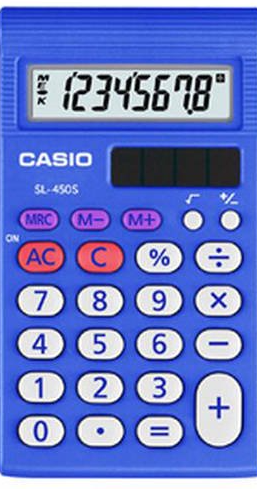

# Calculator Using HTML, SASS & JS

## JS logic 

### I. When clicking numbers 
 
   => create a globle variable (string type)  
   => concatenate entered value to globle string  
   => use switch case for different numbers  
   => write that string to the DOM

### II. When clicking Math operators  
     => call a switch function with parameter of different operator  
     => inside a case, call check existing operator function  
     => set the return of the function to the goble string  
     => write that new string to the DOM

### III. Check Existing Operator Function  
     => have two parameters (the goble string and the entered operator)  
     => check if the start of the string is a ('-') minus sign  
            => if it is, take the minus out 
            => then check if there is any math operator in the remaining string 
                   => if there is, then split the string into two parts  
                   => send those numbers and operator to calcuation function 
            => else return the string
     => else 
            => then check if there is any math operator in the remaining string 
                   => if there is, then split the string into two parts  
                   => send those numbers and operator to calcuation function 
            => else return the string  

### IV. Calculation Function  
     => switch case (get three params: firstNum, secondNum, and operator);
     => do calculation of two numbers based on the operator

### V. Adding Decimal 
      // if clicked demical 
     // check the operator 
    //=> if operator doesn't exit () {
        // check for the decimal
            // if decimal doesn't exist  => concat the decimal 
            // if it exist => don't concat decimal to the string
    // if operator exist => split the string 
        // => check the second value has decimal 
        //     => if exit => don't concat (just return the previous string)
        //     => if not => concat the decimal 
        // 

### Calculator  

